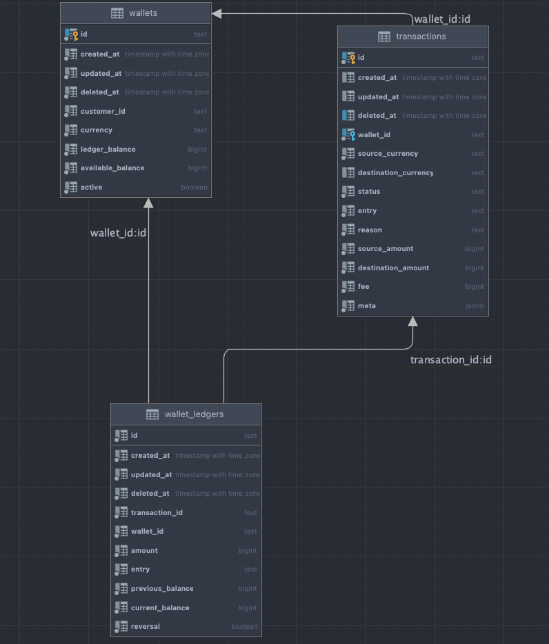

# Opay wallet Engine


## Docs

Made use of DDD(Domain Driven Design) pattern and DI(Dependency Injection)

> Amount in this service make use of the currency smallest unit. Eg NGN make use of kobo

Database model



- Wallet: the wallet entity
- Transaction: the Wallet transaction entity
- WalletLedger: the wallet ledger entity. Tracks all wallet balance Update event  

## API Endpoint

### - Create Wallet [POST]
> URL: localhost:3000/api/v1/wallet/create


Request:
```json
{
  "customer_id": "12345",
  "currency": "NGN"
}
```

Response:
```json
{
  "status": true,
  "message": "Wallet created successfully",
  "data": {
    "wallet_id": "8b7f48b8-8154-4c0a-b1e1-407f8f0fd8cb",
    "customer_id": "12345",
    "available_balance": 0,
    "currency": "NGN"
  }
}
```

### - Credit Wallet [POST]
> URL: localhost:3000/api/v1/wallet/credit


Request:
```json
{
  "wallet_id": "8b7f48b8-8154-4c0a-b1e1-407f8f0fd8cb",
  "customer_id": "12345",
  "amount": 110000,
  "reason": "Test transfer",
  "currency": "NGN"
}
```

Response:
```json
{
  "status": true,
  "message": "Wallet credit initiated successfully",
  "data": {
    "wallet_id": "8b7f48b8-8154-4c0a-b1e1-407f8f0fd8cb",
    "amount": 110000,
    "fee": 0,
    "reference": "6c9f72b4-9705-4a20-ac41-b718af31fade"
  }
}
```


### - Debit Wallet [POST]
> URL: localhost:3000/api/v1/wallet/debit


Request:
```json
{
  "wallet_id": "8b7f48b8-8154-4c0a-b1e1-407f8f0fd8cb",
  "customer_id": "12345",
  "amount": 110000,
  "reason": "Test transfer",
  "currency": "NGN"
}
```

Response:
```json
{
  "status": true,
  "message": "Wallet credit initiated successfully",
  "data": {
    "wallet_id": "8b7f48b8-8154-4c0a-b1e1-407f8f0fd8cb",
    "amount": 110000,
    "fee": 0,
    "reference": "6c9f72b4-9705-4a20-ac41-b718af31fade"
  }
}
```


### - Activate/Dactivate Walllet [GET] 
> URL: localhost:3000/api/v1/wallet/set-status/<wallet-id>/?status=

status values: de-activate | activate 

> localhost:3000/api/v1/wallet/set-status/8b7f48b8-8154-4c0a-b1e1-407f8f0fd8cb/?status=de-activate

Response:
```json
{
"status": true,
"message": "Request initiated successfully"
}
```


Note:

- If given more tome I would add/implement the following
  - [] Write Test (Unit and End-to-End)
  - [] Add Swagger Docs (Open API)
  - [] Add a more robust custom form validation
  - [] More Code documentation